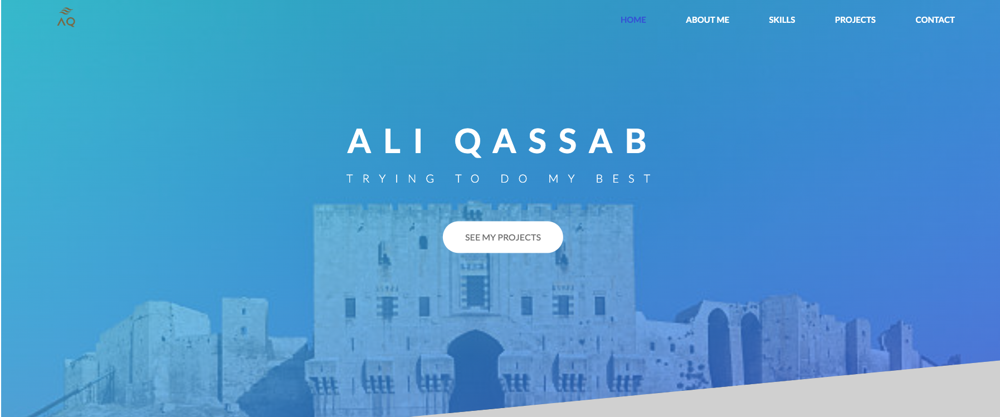

# Ali Qassab - Full-Stack Developer Portfolio

A modern, responsive portfolio website showcasing my journey from accountant to full-stack developer, highlighting my technical skills and featured projects.



## 🚀 About Me

I'm a full-stack developer with a unique background combining over 10 years of accounting experience with 4+ years of web development expertise. My journey from business owner to developer has given me a rare blend of technical skills and business acumen, allowing me to build solutions that are not only technically sound but also drive real business results.

## ✨ Features

- **Responsive Design** - Fully optimized for desktop, tablet, and mobile devices
- **Modern UI/UX** - Clean, professional design with smooth animations and transitions
- **Interactive Navigation** - Mobile-friendly hamburger menu with smooth scroll navigation
- **Project Showcase** - Featured projects with flip card animations and live demos
- **Skills Section** - Highlighted technical expertise with visual cards
- **Downloadable CV** - Easy access to download my resume in PDF format
- **Contact Integration** - Direct links to GitHub, LinkedIn, and email
- **Performance Optimized** - Fast loading with preloaded critical assets and lazy loading
- **Accessibility** - Semantic HTML and ARIA labels for better accessibility

## 🛠️ Technologies Used

### Frontend

- **HTML5** - Semantic markup for better SEO and accessibility
- **CSS3** - Modern styling with Flexbox, Grid, animations, and gradients
- **JavaScript (ES6+)** - Interactive features and dynamic content
- **Font Awesome** - Professional icons

### Design Features

- Custom gradient backgrounds with animations
- Clip-path polygon shapes for unique visual elements
- Smooth scroll behavior
- Mobile-first responsive design approach
- CSS custom properties for consistent theming

### Performance Optimizations

- Preconnected external domains
- Preloaded critical images (LCP optimization)
- Lazy loading for images below the fold
- Deferred non-critical CSS loading
- Font display swap for better performance

## 📂 Project Structure

```
Portfolio/
├── index.html              # Main HTML file
├── style.css              # Main stylesheet
├── queries.css            # Responsive media queries
├── main.js                # JavaScript functionality
├── Alaa_Qassab_CV.pdf    # Downloadable CV
├── img/                   # Image assets
│   ├── logo.png
│   ├── aleppo.jpeg
│   ├── chat-img.png
│   ├── shopping-list.png
│   └── wether.png
└── README.md              # Documentation
```

## 🎯 Key Sections

1. **Hero Section** - Eye-catching header with background image and call-to-action
2. **About Me** - Professional journey and what drives me (with expandable popups)
3. **Skills** - Technical expertise in HTML/CSS, JavaScript, React, and Node.js
4. **Projects** - Featured work including:
   - Group Chat App (WebSocket real-time communication)
   - Shopping List (React with state management)
   - Weather App (API integration with geolocation)
5. **Contact** - Social links and CV download

## 🚀 Getting Started

### Prerequisites

No special prerequisites needed! This is a static website that runs in any modern web browser.

### Installation

1. **Clone the repository**

   ```bash
   git clone https://github.com/AliQassab/Portfolio.git
   ```

2. **Navigate to the project directory**

   ```bash
   cd Portfolio
   ```

3. **Open in browser**
   ```bash
   # Simply open the index.html file in your preferred browser
   open index.html
   ```

### Local Development

For local development with live reloading, you can use any local server:

**Using Python:**

```bash
# Python 3
python -m http.server 8000

# Python 2
python -m SimpleHTTPServer 8000
```

**Using Node.js (http-server):**

```bash
npx http-server -p 8000
```

**Using VS Code:**

- Install the "Live Server" extension
- Right-click `index.html` and select "Open with Live Server"

Then visit `http://localhost:8000` in your browser.

## 📱 Responsive Breakpoints

The portfolio is optimized for the following breakpoints:

- **Mobile**: < 576px
- **Tablet Portrait**: 576px - 768px
- **Tablet Landscape**: 769px - 992px
- **Desktop**: 993px - 1200px
- **Large Desktop**: 1201px - 1400px
- **Extra Large**: > 1400px

## 🎨 Color Palette

- **Primary Gold**: `#d4af37` - Accent color for links and highlights
- **Dark Brown**: `#83754e` - Headers and borders
- **Medium Brown**: `#6b5b47` - Secondary elements
- **Dark Background**: `#1a1612` - Main background
- **Card Background**: `#2a2520` - Content cards
- **White Text**: `#f5f3f0` - Primary text color

## 📞 Contact

**Ali Qassab**

- **Email**: [aliqassabuk@gmail.com](mailto:aliqassabuk@gmail.com)
- **LinkedIn**: [linkedin.com/in/alaa-qassab-524a78244](https://www.linkedin.com/in/alaa-qassab-524a78244/)
- **GitHub**: [github.com/AliQassab](https://github.com/AliQassab)
- **Portfolio**: [View Live Site](https://qaliportfolio.netlify.app/)

## 🙏 Acknowledgments

- Font Awesome for the icon library
- Google Fonts for the Lato font family
- Inspiration from modern portfolio designs

---

⭐ **If you like this portfolio, feel free to star the repository!**

_Last Updated: October 2026_
